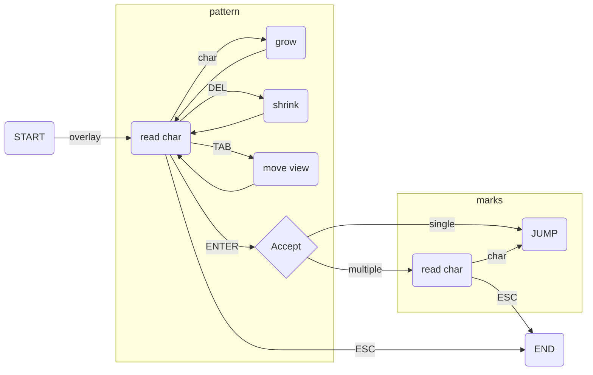

<p align="center">
  
   <p align="center"> The one-trick pony of searching.
</p>


# onesearch.nvim
What is onerseach? Not his [highness of motion](https://github.com/easymotion/vim-easymotion) nor a mind bending [approach](https://github.com/ggandor/leap.nvim).

This pony does one thing and one thing only: interactively searches for a pattern.

## Installation
Using [packer.nvim](https://github.com/wbthomason/packer.nvim)

```lua
 use { 'lfrati/onesearch.nvim', config = function()
        vim.keymap.set("n", "/", ":lua require('onesearch').search()<CR>")
 end }
```

## How it works

Onesearch has only one main function `search()`, which dims the text on screen and starts an interactive string search. As you type the matches in the currently visible area are highlighted in green, if there is only a single match the color will change to light blue. Pressing `<Tab>` will move through the files showing groups of matches. Upon pressing `<CR>` the highlight changes to showing single char hints that can be used to jump to the matches. If there is a single match jump immediately.

See the following diagram:


