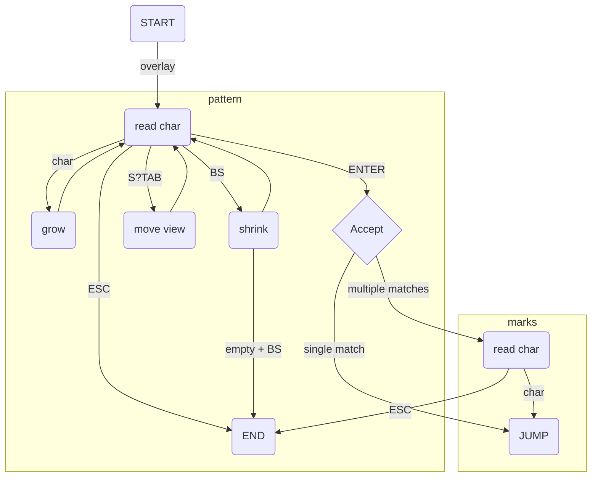

<p align="center">
  
   <p align="center"> The one-trick pony of searching.
</p>


# 🔎 onesearch.nvim
> "Oh, sure, it can do anything you want." said the old man
> 
>  "As long as what you want is what it does."

### Why onesearch.nvim?
Plugins like [easymotion](https://github.com/easymotion/vim-easymotion) make moving through text a pleasure. However, after trying [many different ones](#similar-plugins) I haven't found one that fits my needs perfectly. So I've decided to make it myself. 
Features of onesearch include:
- simplicity: the actual code is <400 lines in a single file. Feel free to take a look, there are comments too!
- opinionated: no complex configuration needed. It doesn't try cover all your needs, but insted focus on one use case.
- realistic: we are not machines (yet?), we make mistakes and mistype. Embracing that allows to recover quickly.
- visual: control are simple but the interface is rich. Use color and simple animations to be clear about what's happening.

## 📦 Installation

Requires `neovim >= 0.8`

Using [vim-plug](https://github.com/junegunn/vim-plug)

```viml
Plug 'lfrati/onesearch.nvim'
  nmap / :lua require('onesearch').search()<CR>
```

Using [packer](https://github.com/wbthomason/packer.nvim)

```lua
 use { 'lfrati/onesearch.nvim', config = function()
        vim.keymap.set("n", "/", ":lua require('onesearch').search()<CR>")
 end }
```

## ⚙️ How it works

Onesearch has only one main function `search()`, which dims the text on screen and starts an interactive string search. As you type the matches in the currently visible area are highlighted, if there is only a single match the color will change. 

Single match           |  Multiple matches             | Hints
:-------------------------:|:-------------------------:|:-------------------------:
 |  |  

Pressing `<Tab>` will loop through groups of matches (`<S-Tab>` will go back). Upon pressing `<CR>` the search ends and the jumping begins. The highlight changes to red, showing single char hints that can be used to jump to the matches. If there is only a single match visible it will jump immediately.

While searching for a pattern, errors (i.e. chars that lead to no matches) are shown in red. Note: characters in the search patter are escaped so that every search is literal, no weird regex trickery, just good ol' strings of code.

Multiple matches  + errors         |  Single match   + errors           
:-------------------------:|:-------------------------:
 | 

You can delete all the errors with a single press of `<BS>` and continue searching. Also when a target is chosen the corresponding line flashes briefly. This is helpful in case of typos while selecting the target because it avoids losing track of the cursor.

| Landing Flash  | S-Tab Flash |
| :-------------: | :-------------: |
| <video src="https://user-images.githubusercontent.com/3115640/202806932-80fce90e-4f46-4d0a-bebd-7f17e2687f3e.mov" controls>  | <video src="https://user-images.githubusercontent.com/3115640/202809030-5db6be9c-3cef-4103-b146-37e12bccb3bb.mov" controls>|


## 🎁 Extra goodies
- populate `/` register : use `n` to quickly search for more matches ( see `:help quote_/` )
- set ``` m` ``` : use ``` `` ``` or ``` '' ``` to go back where you came from ( see `:help mark-motions` )
- embrace laziness: don't feel like deleting errors? just `<CR>`! don't feel like picking char? just `<CR>`!
- up to 324 default hints : use pairs of hints to select from a large pool of matches, only when needed.

Select first char        |  Select second char        
:-------------------------:|:-------------------------:
 | 

## 🛠 Configuration
What can I change?
- Don't like the default colors? Pick your own. 
- Don't want flashes? Set flash_t to zero.
- Don't like the chars used for hints? Provide your own[^1].
```lua
require("onesearch").setup{
    flash_t = 150,                         -- how long flash lasts upon landing, set to 0 for no flash
    hl = {
        overlay = "OnesearchOverlay",      -- highlight for the background during search
        multi = "OnesearchMulti",          -- highlight for multiple matches
        single = "OnesearchSingle",        -- highlight for single match
        select = "OnesearchRed",           -- highlight for hints during target selection
        flash = "OnesearchFlash",          -- highlight for landing flash
        error = "OnesearchRed",            -- highlight for no-matches flash
        current_char = "OnesearchCurrent", -- highlight for char to be chosen from pair
        other_char = "OnesearchOther",     -- highlight for other char in the pair
        prompt_empty = "OnesearchYellow",  -- highlight for prompt upon empty search pattern
        prompt_matches = "OnesearchGreen", -- highlight for default prompt
        prompt_nomatch = "OnesearchRed",   -- highlight for non-matching prompt
    },
    prompt = ">>> Search: ",               -- prompt header
    hints = { "a", "s", "d", "f", "h", "j", "k", "l", "w", "e", "r", "u", "i", "o", "x", "c", "n", "m" }
}
```

## 🏗️ Design
The design of onesearch revolves around simplicity. No trying to decrypt arcane VimL incantations. Just some simple effective Lua. The plugin looks for matches in the visible lines plus one more match (if present) to guide forward searches. This means that the file size doesn't really matter, only your window size. This is also why we disable fancy broad regexes in favor of specific code strings. Hinting is also designed around simplicity. The same code used to show matches and errors, is used to show single or double hints (e.g. match -> hint1, errors -> hint2). Less code, less bugs, less confusion and less time needed to improve the experience. The plugin implements a simple finite state automata controlled by only 4 main keys: CR, BS, S-TAB, TAB.



## Similar Plugins
Haven't found what you looked for? Maybe you'll have better luck with one of these:
- [easymotion](https://github.com/easymotion/vim-easymotion)
- [sneak](https://github.com/justinmk/vim-sneak)
- [hop](https://github.com/phaazon/hop.nvim)
- [leap](https://github.com/ggandor/leap.nvim)
- [svart](https://gitlab.com/madyanov/svart.nvim/-/tree/master)
- [sj](https://github.com/woosaaahh/sj.nvim)


[^1]: Hints are applied top-to-bottom, beacuse when you tab around your cursor is set to the top one.
