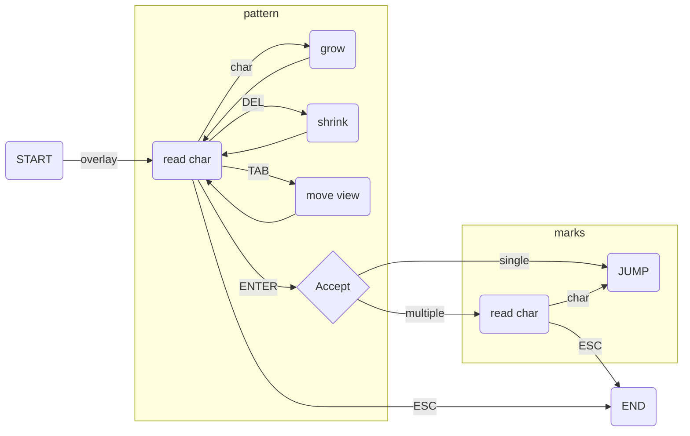

<p align="center">
  
   <p align="center"> The one-trick pony of searching.
</p>


# onesearch.nvim
What is onesearch? Not his [highness of motion](https://github.com/easymotion/vim-easymotion) nor a mind bending [approach](https://github.com/ggandor/leap.nvim).

This pony does one thing and one thing only: interactively searches for a pattern.

## Installation
Using [packer.nvim](https://github.com/wbthomason/packer.nvim)

```lua
 use { 'lfrati/onesearch.nvim', config = function()
        vim.keymap.set("n", "/", ":lua require('onesearch').search()<CR>")
 end }
```

## How it works

Onesearch has only one main function `search()`, which dims the text on screen and starts an interactive string search. As you type the matches in the currently visible area are highlighted in green, if there is only a single match the color will change to light blue. 

Multiple matches           |  Single match             | Hints
:-------------------------:|:-------------------------:|:-------------------------:
   |   |  

Pressing `<Tab>` will loop through groups of matches. Upon pressing `<CR>` the search ends and the jumping begins. The highlight changes to red, showing single char hints that can be used to jump to the matches. If there is only a single match visible it will jump immediately.


## Configuration
The default settings are already perfect, why would you change them?

But if you really want to just override the following defaults:
```lua
require("onesearch").setup{
    flash_t = 150,                    -- how long it flashes for, set to 0 for no flash
    hl = {
        overlay = "NonText",          -- highlight for the background during search
        multi = "OnesearchMulti",     -- highlight for multiple matches
        single = "OnesearchSingle",   -- highlight for single match
        select = "WarningMsg",        -- highlight for hints during target selection
        flash = "Search",             -- highlight for landing flash
    },
    hints = { "a", "s", "d", "f", "h", "j", "k", "l", "w", "e", "r", "u", "i", "o", "x", "c", "n", "m" }
}
```
