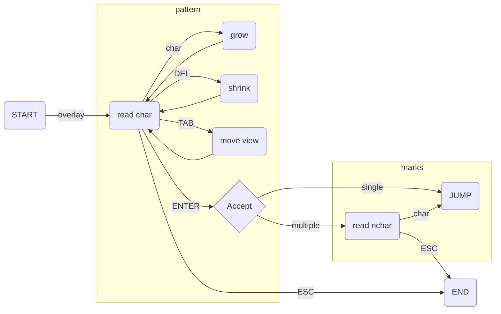

# onesearch

The one-trick pony of searching. Opinionated and simple.

```mermaid
graph LR
    A(START) -->|overlay| B(read char)
    B -->|ESC| C(END)
    subgraph pattern
        B --> |char| E(grow) --> B
        B --> |DEL| F(shrink) --> B 
        B -->|TAB| G(move view) --> B
        B -->|ENTER| D{Accept}
    end
    subgraph marks
        D --> |single|J
        D --> |multiple|H(read nchar)
        H --> |char|J(JUMP)
    end
    H --> |ESC|C
```
